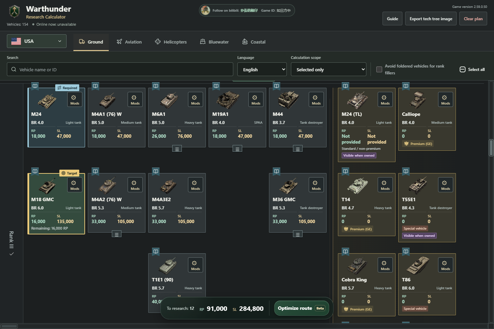
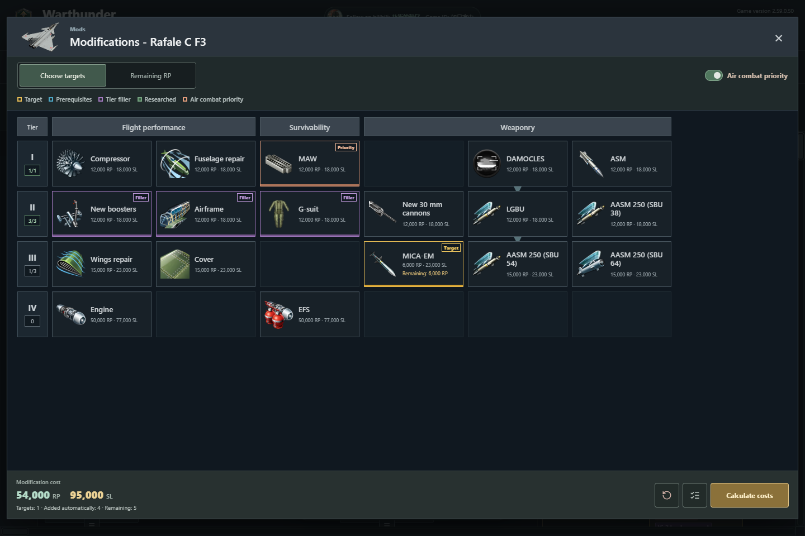
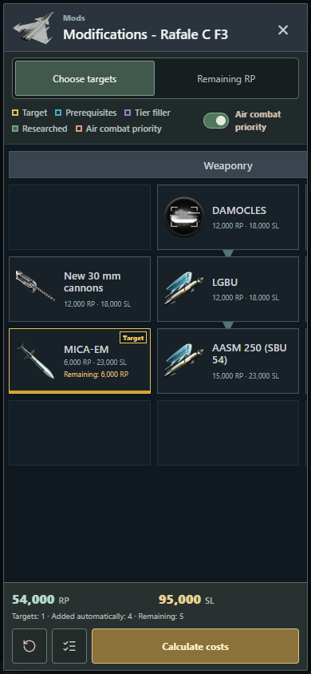

  

<h1 align="center">War Thunder Research Calculator</h1>

Choose your targets. Map your route. Know the RP and Silver Lions you need.

  <a href="https://plastic-time.github.io/warthunder-research-calculator/"><strong>Open Web App</strong></a> &nbsp; · &nbsp;
  <a href="https://github.com/Plastic-time/warthunder-research-calculator/releases/latest"><strong>Download for Windows</strong></a> &nbsp; · &nbsp;
  <a href="doc/web-updates.md#english">Changelog</a>

<a href="README.md">简体中文</a> &nbsp; / &nbsp; <strong>English</strong>

3,235 vehicles · 3,225 modification trees · 5 vehicle categories · 7 UI languages

## Plan Your Research Route

Set your targets and mark the vehicles you own. The calculator searches for a low-RP route. It checks prerequisites and rank unlock requirements, then totals the RP and Silver Lions.

- **Understand each selection**: distinguish targets, waypoints, required vehicles, and rank fillers. Foldered groups show how many vehicles are selected.
- **Adjust the result**: remove a vehicle or mark it as owned without clearing the rest of the route. Run the planner again when you want a new calculation.
- **Use the remaining RP shown in the game**: if a 140,000 RP vehicle needs 60,000 more, enter 60,000. Budgets and route choices use that amount. Its Silver Lion cost stays the same.
- **Mark ranks as owned**: mark regular vehicles at a chosen rank and all lower ranks. Review the list before confirming, or undo the change afterward. Special and hidden vehicles are excluded.
- **Keep the budget in view**: see the remaining vehicle count, RP, and Silver Lions in the bottom bar. Export the complete tech tree and its budget as an image.

> Route optimization is a beta feature. The search has a computation limit. It returns the best route found. A cheaper route may still exist. Check the result in the game before researching.

## Build Your Modification Plan

Open a vehicle's modification window and choose the upgrades you need. Mark researched items. The calculator adds prerequisites and any extra upgrades needed to unlock the next tier.

- **Choose freely**: select one upgrade or several. RP, Silver Lions, and tier counts update immediately.
- **Complete the requirements**: Calculate costs adds prerequisites and tier fillers. Researched items are not charged again.
- **Enter remaining RP**: switch to Remaining RP and select an upgrade. Enter the amount shown in the game. Enter 0 when no RP remains. Enter the full cost to clear that progress record. Existing records are converted for display. No re-entry is needed.
- **Prioritize air combat**: this option is on by default. You can turn it off. It favors countermeasures and air combat upgrades. Missile research follows your chosen targets and their actual prerequisites.
- **Clear in one action**: the curved-arrow button clears targets, researched marks, and progress for the current vehicle's modifications. It keeps the air combat setting. Other vehicles are not affected.
- **Keep costs separate**: modification costs do not enter the vehicle research total. Upgrades explicitly priced at 0 RP and 0 SL are marked as unlocked.

View the mobile modification window

## Get Started

| Action | Desktop | Mobile |
| --- | --- | --- |
| Select or deselect a vehicle target | Left-click | Tap |
| Set owned status, waypoints, and other roles | Right-click for the menu | Press and hold for about half a second |
| Enter remaining RP for a vehicle | Right-click → Research Progress | Press and hold → Research Progress |
| Calculate a route | Select Optimize route in the bottom bar | Same |
| View vehicle information | Select the Wiki bookmark on the card | Same |

On mobile, open More at the top to find the guide and export controls. Search and filters have separate buttons. See the [web changelog](doc/web-updates.md#english) for recent changes. The in-app guide keeps earlier release notes.

Open the web app to start. No game account is required. On Windows, download the [v1.0.26 portable package](https://github.com/Plastic-time/warthunder-research-calculator/releases/download/v1.0.26/WarThunderResearchCalculator-v1.0.26-portable.zip). Extract it and run `WarThunderResearchCalculator.exe`. No separate Node.js installation is needed.

> This guide and its screenshots show the current web app. The v1.0.26 download does not include the latest modification layout, combined clear button, or remaining-RP input. It does not receive web updates automatically.

Select all toggles the current nation's regular research tree, including foldered vehicles. It keeps owned marks and research progress. Exported screenshots show original tree totals and the RP and Silver Lions still needed for your selection. Missing costs are clearly flagged.

Zero remaining RP does not mark a vehicle as owned or an upgrade as researched. Set those states separately. Silver Lion costs stay unchanged. Enter a whole number from 0 to the full RP cost. Blank input is not accepted.

Clear Plan removes selections, status marks, and vehicle research progress for the current nation and category. The modification window has one clear button. It removes that vehicle's modification targets, researched marks, and progress together.

Browse ground vehicles, aircraft, helicopters, bluewater fleets, and coastal fleets. The interface and vehicle names support Chinese, English, Russian, German, French, Japanese, and Spanish. This project does not translate third-party Wiki articles.

## Data and Limitations

- **Versioned snapshots**: the overall vehicle-cost baseline is game version **2.59.0.17**. It is not a live game feed. Future cost and prerequisite checks use game configuration as the primary source. Wiki supplements names, images, and layout. Existing importers still use some legacy sources.
- **Scoped corrections**: confirmed Ka-29 and Do 217 J-2 corrections remain in place. Version 1.0.11 uses configuration **2.59.0.34** to set GLBC mk.3 on both CA-27 variants to **9,000 RP / 14,000 SL**. This is not a full snapshot upgrade.
- **Retained correction**: v1.0.19 updates F4U-7 modification costs, the cannon upgrade tier, and unlock counts using **2.59.0.38**. All modifications total **47,800 RP / 86,900 SL**.
- **Latest data corrections**: v1.0.25 updates modifications for the Greek F-86E(M), MiG-23M, and Object 416 using **2.59.0.50**. See the [release notes](doc/release-v1.0.25.md#english) for costs and prerequisites. This is not a full data upgrade. The latest UI and documentation changes do not alter game data.
- **Unknown is not free**: missing prices are shown as unavailable, not zero. Rank-unlock counts still use a separate project rules table. Verify your route in the game.
- **Plans stay in your browser**: selections, routes, and RP progress are saved locally. They are not uploaded or synced between devices. Clearing site data deletes these records. Images, Wiki pages, and the online counter need a connection. The counter estimates active browsers. An outage does not affect calculations.

Development, maintenance, and further reading

- [Local setup and data maintenance](doc/development.md) (Chinese)
- [Server configuration and update permissions](doc/server-security.md) (Chinese)
- [Online counter rules](doc/online-counter.md) (Chinese)
- [Modification artwork sources](doc/ammunition-artwork.md) (Chinese)
- [Vehicle snapshot manifest](docs/database/manifest.json) · [Modification audit](tools/modifications-audit.json)
- [v1.0.26 notes](doc/release-v1.0.26.md) · [All releases](https://github.com/Plastic-time/warthunder-research-calculator/releases)

---

An unofficial, player-made tool. Not affiliated with Gaijin Entertainment. Game names, vehicle images, and other third-party assets belong to their respective owners.

 &nbsp; bilibili: <a href="https://space.bilibili.com/543495611">扑街的靓仔</a> &nbsp; · &nbsp; In-game ID: 如日方中

